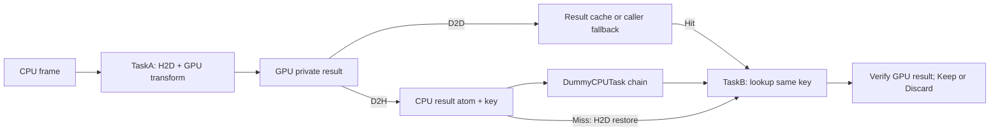

# Result-cache pipeline simulation

`demo/ResultPipeline/` provides `TaskA`, `DummyCPUTask`, `TaskB`, and a bounded
three-worker scheduler shared by the tests and manual benchmark. This is a
separate demo harness; it does not change the production cache API or the
existing frame-only `DummyGraph`.



## Tasks and ownership

- **TaskA** uploads an input frame and runs a byte-wise XOR GPU kernel. It copies
  the private result into the selected cache/fallback buffer with D2D, and into
  pinned host staging with D2H. After `freeCacheData(true)` completes, it copies
  the host result into the atom and publishes the atom to the CPU queue. Each
  frame has a unique ID, mapped to `key.frameId` in this separate result cache.
- **DummyCPUTask** reads the authoritative CPU result, calculates a checksum,
  and optionally sleeps to simulate additional CPU-stage latency. Several
  instances form the configurable CPU chain. No GPU lease spans this chain.
- **TaskB** uses the atom's unchanged key and metadata with its own CUDA stream.
  A Hit avoids result H2D; a Fill or Fallback restores the atom. B performs D2D
  to its private output, D2H for verification, and completes with Keep/Discard.
  Verification checks every byte against both the atom and the expected XOR
  of the original frame. B also checks the number of completed CPU stages.

Tasks infer the unique GPU from framework NUMA affinity during `load()`.
Each GPU task allocates its own stream, pinned staging, private result and
fallback storage during load. TaskA safely reuses its input allocation as
fallback after the same stream's kernel has finished reading the input.
The graph-scoped cache outlives all accesses.

The scheduler has one A worker, one CPU-chain worker, and one B worker, all on
the graph's NUMA node. Different frames overlap across these workers. CPU
stages are serial within one CPU worker; this does not model a general DAG or
multiple instances of each stage. B releases an atom slot back to A only after
completion. `inFlight` bounds the total live frames across all stages, and
`peakInFlight` records the observed overlap. Queues propagate task failures
and wake blocked workers; all threads join before cleanup.

## Correctness tests

`tests/result_pipeline_tests.cpp` runs through `gpuinfra_protocol_tests`:

- For both policies and both retention settings, fixed ordering
  `A1 → A2 → CPU1 → B1 → A3 → CPU2 → B2` with capacity 2 verifies which result
  survives. LRU/Keep evicts result 2; FIFO/Keep and either policy with Discard
  preserve it. B always produces the correct bytes, including CPU recovery.
- B rejects an atom before its CPU stages finish.
- Held readers force both A and B to use fallback; the CPU atom still preserves
  the result. These forced readers are a separate stress case, not the usual
  CPU-stage gap.
- Corrupted CPU data fails verification, and reset confirms no lease remains.
- The threaded pipeline tests one and eight in-flight frames, three CPU tasks,
  reusable task buffers, transaction counts, upload accounting, and cleanup.
  There are no timing-dependent assertions about speed or concurrent hit rate.

## Benchmark

```sh
cmake -S . -B cmake-build-nvtx-off -DCMAKE_BUILD_TYPE=RelWithDebInfo -DGPUINFRA_ENABLE_NVTX=OFF
cmake --build cmake-build-nvtx-off --parallel 4 --target gpuinfra_result_pipeline_benchmark
# entries in_flight frames bytes cpu_stages cpu_delay_us repeats
./cmake-build-nvtx-off/gpuinfra_result_pipeline_benchmark 8 32 1000 65536 3 50 3
```

The manual target is excluded from default builds and CTest. Each invocation
runs all four LRU/FIFO × Keep/Discard combinations with rotating order. A
separate 16-frame warmup precedes fresh-cache measured trials. Cache wait uses
the current default, 50 ms. NVTX-enabled builds annotate A, CPU and B stages
with fixed range names in addition to core cache annotations.

CSV reports throughput, frame latency p50/p95, observed in-flight count,
**B-only** hits and H2D bytes, combined A/B cache hit/fill/eviction/discard,
fallback reasons, and wait count/total/maximum. B H2D does not include A's
mandatory frame upload. Every completed frame is validated before reporting.

Timing starts after all workers load and reach the start barrier, and ends
after the workers join. It includes initial pipeline fill and final drain,
input preparation, the real CUDA transform/copies/synchronization, CPU
checksums/delays, queue scheduling, CPU atom copies, and output verification.
It excludes allocation/load, warmup, percentile sorting and resource cleanup.
Frame latency starts when A acquires a reusable slot; it includes queue waits
through B verification, but excludes waiting for admission to the pipeline.
Host atoms are preallocated; standard queue containers may allocate during
execution.

The sleep duration is a requested delay, not a guarantee or CPU utilization
model. The transform is deliberately simple. These measurements characterize
this harness and its policy behavior, not AOI algorithm throughput. Real graph
fanout, out-of-order CPU completion, multiple stage instances, and different
payload sizes require separate workload measurements.

[Recorded measurements](../results/benchmarks/20261004-result-pipeline/README.md)
